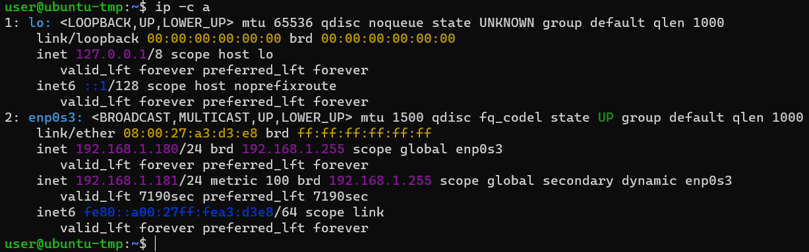
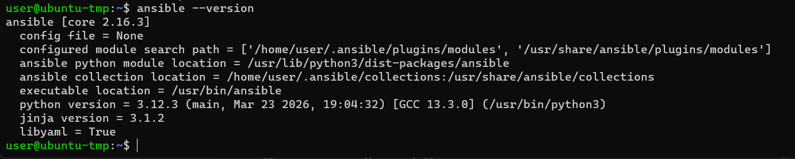
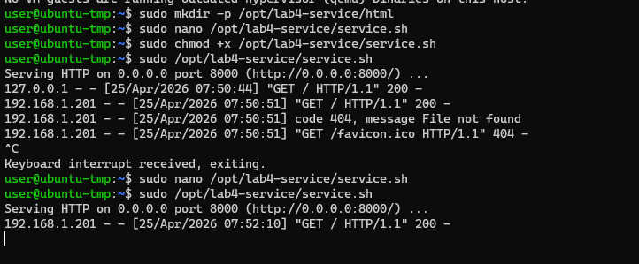
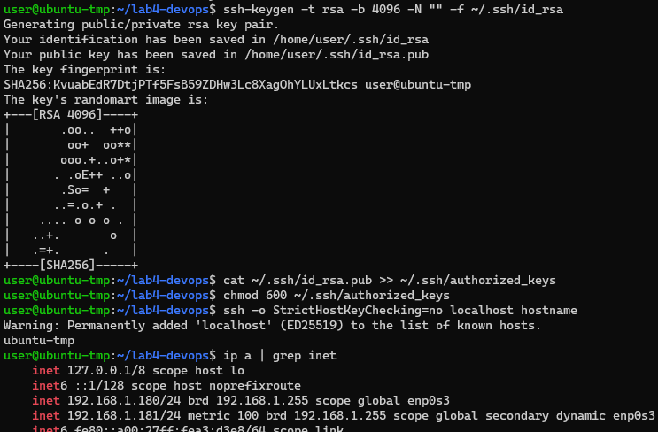

# Отчёт по лабораторной работе №4  
**Тема:** DevOps‑автоматизация: systemd, bash‑скрипты и Ansible  

**Студент:** Фролкин Никита

---

## 1. Среда выполнения

| Параметр | Значение |
|----------|----------|
| Гипервизор | VirtualBox 7.0 |
| Образ | Ubuntu Server 24.04 LTS |
| Имя ВМ | ubuntu-tmp |
| IP-адрес ВМ | 192.168.1.180 |
| Пользователь | user (с правами sudo) |
| Версия Ansible | core 2.16.3 |
| Версия Python | 3.12.3 |


---

## 2. Задание 1. Подготовка ВМ

Установлены необходимые пакеты: `git`, `curl`, `python3`, `python3-venv`, `ansible`.

```bash
sudo apt update
sudo apt install -y git curl python3 python3-venv ansible
```

---

## 3. Задание 2. Bash‑скрипт сервиса

Файл `/opt/lab4-service/service.sh`:

```bash
#!/usr/bin/env bash
set -euo pipefail

# Создаём index.html с фамилией
echo "<html><body><h1>Frolkin</h1></body></html>" > /opt/lab4-service/html/index.html

# Запускаем HTTP-сервер на порту 8000
cd /opt/lab4-service/html
exec python3 -m http.server 8000
```

Права доступа: `sudo chmod +x /opt/lab4-service/service.sh`

![\[СКРИНШОТ 4 – содержимое `service.sh` (cat)\]](screenshots/3.png)

**Проверка доступности страницы:**  
После ручного запуска (`sudo /opt/lab4-service/service.sh`) в другом окне:

```bash
curl http://192.168.1.180:8000/
```

Вывод: `<html><body><h1>Frolkin</h1></body></html>`  

![\[СКРИНШОТ 5 – curl запрос и ответ\]](screenshots/1.png)

---

## 4. Задание 3. systemd‑юнит

Создан файл `/etc/systemd/system/lab4-service.service`:

```ini
[Unit]
Description=Lab4 HTTP Service
After=network.target

[Service]
Type=simple
User=www-data
Group=www-data
WorkingDirectory=/opt/lab4-service/html
ExecStart=/opt/lab4-service/service.sh
Restart=on-failure
RestartSec=5
StandardOutput=journal
StandardError=journal

[Install]
WantedBy=multi-user.target
```

**Команды управления:**  

```bash
sudo systemctl daemon-reload
sudo systemctl enable --now lab4-service
sudo systemctl status lab4-service
```

![\[СКРИНШОТ 6 – содержимое unit-файла\]](screenshots/4.png)

![\[СКРИНШОТ 7 – вывод `systemctl status lab4-service` (активный статус)\]](screenshots/5.png)

---

## 5. Задание 4. Логирование и healthcheck

**Логи сервиса:**  

```bash
sudo journalctl -u lab4-service -n 20
```

![\[СКРИНШОТ 8 – вывод `journalctl` (не менее 20 строк)\]](screenshots/6.png)

**Скрипт healthcheck** `/usr/local/bin/lab4-healthcheck.sh`:

```bash
#!/bin/bash
if curl -s -o /dev/null -w "%{http_code}" http://127.0.0.1:8000/ | grep -q 200; then
    echo "OK: service is healthy"
    exit 0
else
    echo "FAIL: service is not responding"
    exit 1
fi
```

![\[СКРИНШОТ 9 – содержимое healthcheck.sh\]](screenshots/7.png)

**Проверка при работающем сервисе:**  

```bash
/usr/local/bin/lab4-healthcheck.sh
# Вывод: OK: service is healthy
```

**Проверка при остановленном сервисе:**  

```bash
sudo systemctl stop lab4-service
/usr/local/bin/lab4-healthcheck.sh
# Вывод: FAIL: service is not responding
sudo systemctl start lab4-service
```

![\[СКРИНШОТ 10 – оба результата (OK и FAIL)\]](screenshots/8.png)

---

## 6. Задание 5. Git и публичный репозиторий

**Локальный репозиторий** создан в `~/lab4-devops`.

**Содержание `.gitignore`:**  
```
inventory.ini
*.swp
__pycache__
```

**Ссылка на публичный репозиторий:**  
[https://github.com/urn6r3lla/lab4](https://github.com/urn6r3lla/lab4)

---

## 7. Задания 6–8. Ansible

### 7.1. Инвентарь (задание 6)

**Рабочий инвентарь** `inventory.ini` (не коммитится, добавлен в `.gitignore`):

```ini
[lab4]
192.168.1.180 ansible_user=user ansible_ssh_private_key_file=/home/user/.ssh/id_rsa ansible_ssh_common_args='-o StrictHostKeyChecking=no'
```

![\[СКРИНШОТ 14 – содержимое `inventory.ini` (без паролей)\]](screenshots/11.png)



**Проверка подключения:**  

```bash
ansible -i inventory.ini lab4 -m ping
```

Вывод:  
```
192.168.1.180 | SUCCESS => {
    "ansible_facts": { "discovered_interpreter_python": "/usr/bin/python3" },
    "changed": false,
    "ping": "pong"
}
```

![\[СКРИНШОТ 15 – вывод `ansible ping`\]](screenshots/9.png)

**Пример безопасного инвентаря** `inventory.example.ini` (закоммичен):

```ini
[lab4]
<IP_адрес_ВМ> ansible_user=<имя_пользователя> ansible_ssh_private_key_file=<путь_к_приватному_ключу>
```

### 7.2. Playbook развёртывания (задание 7)

Файл [`playbook/site.yml`](playbook/site.yml)


**Первый запуск playbook:**  

```bash
ansible-playbook -i inventory.ini playbook/site.yml
```

Вывод (результат):  
```
PLAY RECAP *********************************************************************
192.168.1.180 : ok=6 changed=1 unreachable=0 failed=0
```

![\[СКРИНШОТ 17 – полный вывод первого запуска\]](screenshots/12.png)


### 7.3. Healthcheck через Ansible (задание 8)

В `site.yml` добавлена задача:

```yaml
    - name: Check that service returns HTTP 200
      uri:
        url: "http://127.0.0.1:8000/"
        method: GET
        status_code: 200
      register: result
      failed_when: result.status != 200
```

**Запуск playbook с healthcheck:**  

```bash
ansible-playbook -i inventory.ini playbook/site.yml --ask-become-pass
```

В выводе появилась задача `Check that service returns HTTP 200` со статусом `ok`.  

![\[СКРИНШОТ 20 – вывод playbook с успешным healthcheck\]](screenshots/13.png)

---

## 8. Выводы

### 8.1. Что автоматизировано?

В ходе работы полностью автоматизировано развёртывание и управление HTTP-сервером на базе Python:

- **Bash-скрипт** – запускает сервер и генерирует `index.html` с фамилией студента.
- **systemd** – обеспечивает запуск сервиса при загрузке, перезапуск при сбоях, изоляцию в среде пользователя `www-data`.
- **Логирование и healthcheck** – системные логи (`journalctl`), пользовательский скрипт проверки доступности и аналогичная проверка средствами Ansible.
- **Ansible** – написан идемпотентный playbook, который устанавливает пакеты, создаёт каталоги, копирует файлы, активирует сервис и проверяет его работоспособность.

### 8.2. Использованные DevOps-практики

| Практика | Реализация |
|----------|-------------|
| **Infrastructure as Code (IaC)** | Все конфигурации (скрипты, unit-файл, playbook) хранятся в Git-репозитории. |
| **Идемпотентность** | Повторный запуск playbook не приводит к нежелательным изменениям. |
| **Автоматизация развёртывания** | Одна команда `ansible-playbook` полностью настраивает сервис на целевой ВМ. |
| **Мониторинг (healthcheck)** | Встроенная проверка HTTP-статуса как локальным скриптом, так и модулем `uri`. |
| **Безопасность** | Приватные ключи и пароли не хранятся в репозитории; используется `.gitignore`. |
| **Управление зависимостями** | Плейбук сам устанавливает необходимые пакеты (`curl`, `python3`). |

### 8.3. Трудности и их решения

| Проблема | Решение |
|----------|---------|
| Сервис не запускался из-за прав `www-data` на каталог `/opt/lab4-service` | Изменил владельца на `www-data:www-data` (вручную, затем плейбук автоматизировал это). |
| Некорректные пути к `service.sh` и unit‑файлу в плейбуке | Переместил `site.yml` в корень проекта и исправил относительные пути. |
| Предупреждения о подлинности хоста SSH | Добавил `ansible_ssh_common_args='-o StrictHostKeyChecking=no'` в инвентарь. |

### 8.4. Итог

Лабораторная работа позволила на практике освоить основные элементы **DevOps-конвейера для одного сервиса**:

- написание переносимого bash-скрипта;
- управление сервисом через systemd;
- создание самодостаточного Ansible-плейбука;
- непрерывную проверку работоспособности (healthcheck);
- версионирование конфигураций в Git.

В результате получен **производственно‑готовый сценарий развёртывания**, который можно применять для любого аналогичного HTTP-сервера в средах на базе Ubuntu.
